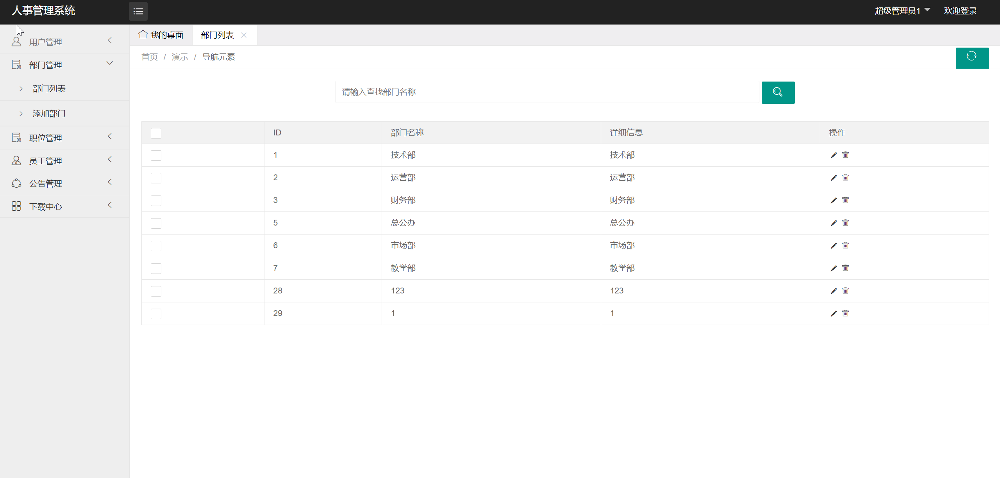
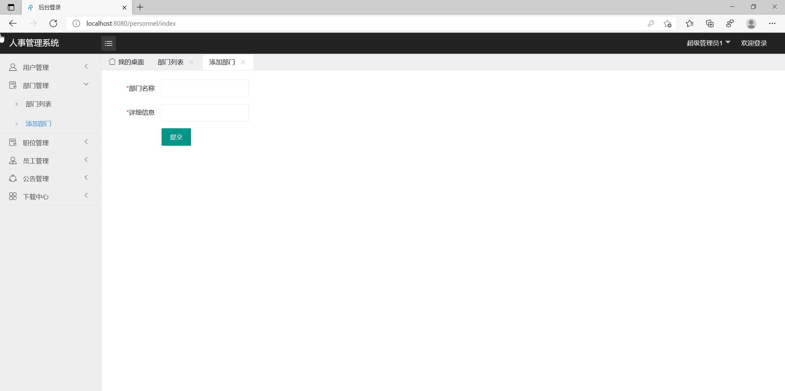
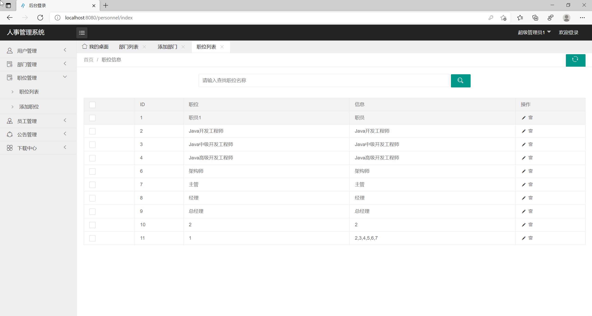
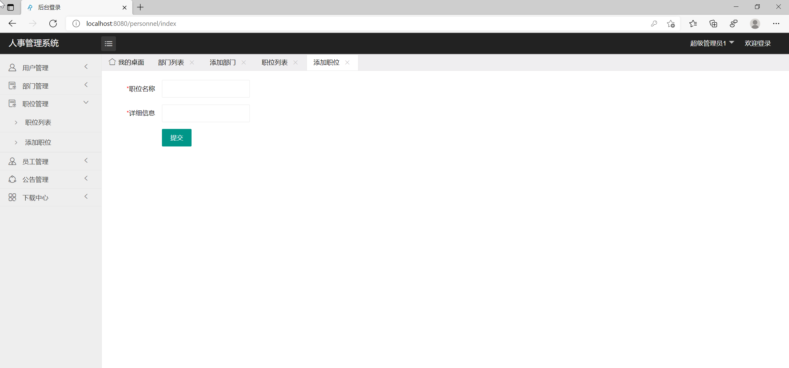
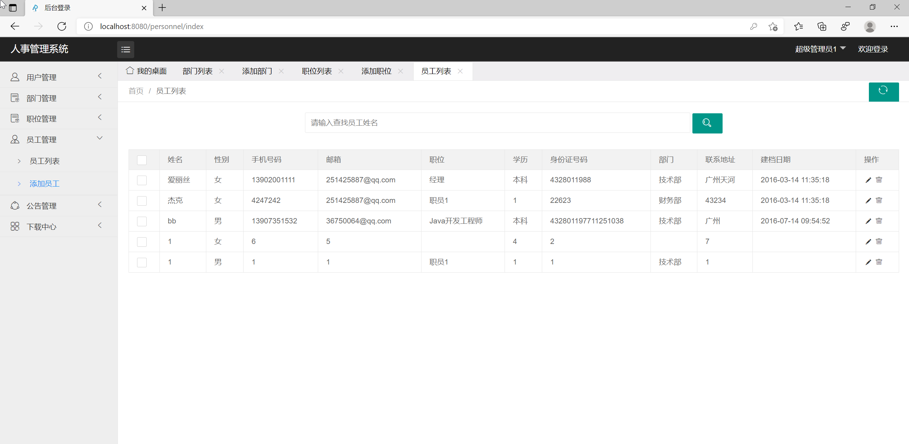
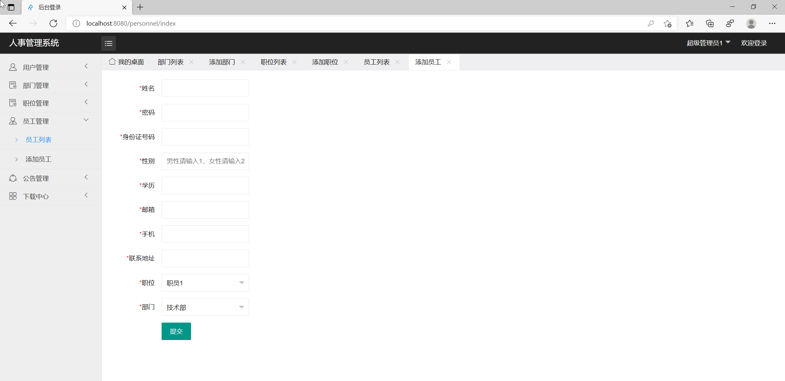

## 基于SSM框架的人事管理系统

- <b>完整代码获取地址：从戎源码网 ([https://armycodes.com/](https://armycodes.com/))</b>
- <b>技术探讨、资料分享，请加QQ群：692619798</b> 
- <b>作者微信：19941326836  QQ：952045282</b> 
- <b>承接计算机毕业设计、Java毕业设计、Python毕业设计、深度学习、机器学习</b>
- <b>选题+开题报告+任务书+程序定制+安装调试+论文+答辩ppt 一条龙服务</b>
- <b>所有选题地址 ([https://github.com/YuLin-Coder/AllProjectCatalog](https://github.com/YuLin-Coder/AllProjectCatalog)) </b>

## 项目介绍
基于SSM框架的人事管理系统，有用户和管理员两个角色，主要功能如下

用户管理功能包括：添加用户，用户可以为管理员或者普通用户;查询用户，可以查询所有用户或根据用户名和用户状态进行模糊查询，删除用户，修改用户。 部门管理的功能包括：添加部门，查询部门，可以查询所有部门或根据部门名称进行模糊查询，删除部门，修改部门 职位管理的功能包括：添加职位，查询职位，可以查询所有职位或根据职位名称进行模糊查询，删除职位，修改职位 员工管理的功能包括：添加员工，查询员工，可以查询所有员工或根据员工姓名，身份证号，手机号，性别，职位，部门进行模查询，删除员工，修改员工。 公告管理的功能包括：添加公告，查询公告，可以查询所有公告或根据公告名称，公告内容进行模糊查询，删除公告，修改公告。 下载中心的功能包括：上传文件，查淘文件，可以查询所有文件或根据文件标题进行模糊查询，预览文件内容：删除文件，下载文件。

## 项目技术
- 编程语言：Java
- 数据库：MySQL
- 前端技术：JSP、JavaScript、Jquery、Layui
- 后端技术：Spring、SpringMVC、MyBatis

## 运行环境
- JDK版本：JDK1.8及以上
- 开发工具：IDEA、Ecplise、Myecplise都可以
- 数据库: MySQL5.7及以上

## 运行截图

